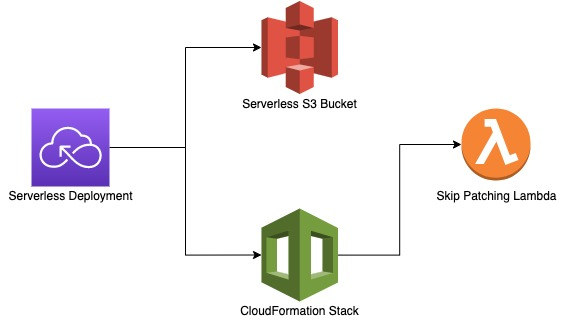

<!-- 
title: 'AWS NodeJS Skip Patching Lambda' 
description: 'This template demonstrates how to deploy a NodeJS function running on AWS Lambda using the traditional Serverless Framework. The Lambda will Take in a JSON Event 'Enabled or Disabled' and will Auto Create a Tag on All EC2 Instances that Match a Certain Criterion. This tag will let SSM know whether to skip the Patching Window for these Instances or not' 
layout: Doc 
framework: v2 
platform: AWS 
language: nodeJS 
priority: 1 
authorLink: 'https://github.com/SeanJ88' 
authorName: 'Sean Jones.' 
companyName: 'DevOpsGroup' 
-->
# AWS NodeJS Skip Patching Lambda

This template demonstrates how to deploy a NodeJS function running on AWS Lambda using the traditional Serverless Framework

The Lambda will Take in a JSON Event 'Enabled or Disabled' and will Auto Create a Tag on All EC2 Instances that Match a Certain Criterion. This tag will let SSM know whether to skip the Patching Window for these Instances or not'

## Infrastructure

In this repository we are deploying the following:

```
- 1 x Lambda
- 1 x IAM Role
- 1 x IAM Policy
```
This is all created in the [Serverless.yml](https://github.com/SeanJ88/Skip_Patching_Lambda/blob/main/serverless.yml) file


### Infrastructure Diagram



### Infrastructure Cost

#### Lambda Function Pricing
```
London (Eu-west-2) Pricing
  - $0.0000166667 for every GB per second
  - $0.0000000083 per Ms for 512Mb Lambdas
  - $0.20 per 1M requests
```
#### Example Cost

We will go over an example for cost for a 1-Month Period.

##### Scenario

We have 100 EC2 instances running with the specific criterion for the Lambda, 
all need to be tagged and give or take 40% of these Instances will need to be skipped once a month.

On average lets say the Lambda invocations will last 200ms minutes.


Subscriber Lambda Invocation Cost: 
```
  - 100 invocations for tagging current Instances
  - 40% tags to be updated = 100 * 0.40 = 40 additional invocations
  - Total Subscriber Innovations = 140 invocations
  - Invocation Cost = $0.20 per 1M Requests = 140/1000000 = $0.20
  - Duration - 200ms x $0.0000000083 = 0.00000166 x 140 = $0.0002324

  Total Cost: $0.20 per month
```

Total Charges First Month
```
 - Skip Patching Lambda - $0.20

 Total Per Month After First Month Estimate 
  - All 100 Instances tagged but 40% a month Running/Terminate still occur.
```
 - Skip Patching Lambda - $0.20

Total Per Month - $0.20

## Usage

:warning: This Tool will need to be invoked Manually and will Tag running instances that have the following tags: :warning:

- MS-CC
- MS-GS
- MS-HA-KS
- MS-KS

The Instances will be tagged with:

- [{"Key": "Skip_Patching", "Value": ${value}}]`

- value being 'Enabled' or 'Disabled'

If the tags are set to any different above, then the Lambda will not subscribe and auto add tags to the instance.

### Prerequisites

- Serverless Framework Installed - v2.x.x or higher
- node installed - v14.x.x or higher
- npm installed - v8.x.x or higher

### Deployment

In order to deploy the example, you need to run the following command:

```
export AWS_PROFILE=profile
serverless deploy --stage stage --region region
```

- Profile should be the Account you want to deploy to listed in your AWS Credentials File.
- Stage should be the environment you want to deploy e.g dev/test/int/prod
- Region should be the region you want to deploy. Defaults to eu-west-2 if not set.
- :warning: If you do not have profiles set up then please assume the role for the account you want to deploy to and run the serverless deploy command :warning:


This deployment should only be deployed once per Account.
I'd recommend if you have an Int account and Dev account in the same account. Then deploy the Lambda with the stage int
### Invocation

After successful deployment, Invocation can either be done through the AWS Console on the Lambda Test event console.

Or you can invoke it locally from your machine by running the following command and passing the JSON test files

- Enabled.json
- Disabled.json

```
serverless invoke --function <function> --stage <stage> --region <region> --path lib/<filename>.json
```

- function - is the name of the function to invoke
- stage - is the environment e.g. dev
- region - is the region you want to invoke it in e.g. us-west-2
- path - is the patch to the file you want to use e.g. lib/enabled.js 


### Local development

If you want to update this Repository then you can find everything
you require in the following folders:

- Lambda Functions     - [Functions](https://github.com/SeanJ88/Skip_Patching_Lambda/tree/main/functions)
- Serverless Resources - [Serverless.yml](https://github.com/SeanJ88/Skip_Patching_Lambda/blob/main/serverless.yml)
- JEST Tests           - [`__`tests`__`](https://github.com/SeanJ88/Skip_Patching_Lambda/tree/main/__tests__)

#### Testing (JEST)

JEST is used to test the Lambda functions and the Library to make sure functionality is working as expected.

These can be found in the JEST Tests folder listed above.

There is a MOCK lambda function and Library location in the JEST
folder. Which contains the same logic as the Live Lambda Functions
However, these files do not contain the AWS SDK calls as these 
cannot be tested without assuming a role and having access with the AWS CLI.

So for these files, example JSON responses have been put in 
place of the AWS Commands.

The example JSON response is in the folder jest/mockfunction/ec2-examples.json

:warning: This file will not exist in the github repository due to the sensitivity of the data :warning:

- If you would like to have the same file, then please run the following aws cli command from the root directory on an environment/account you would like the test data to come from:

```
aws ec2 describe-instances > jest/mockfunction/ec2-examples.json
```

Testing can be done by running the following command:

```
npm run test
```